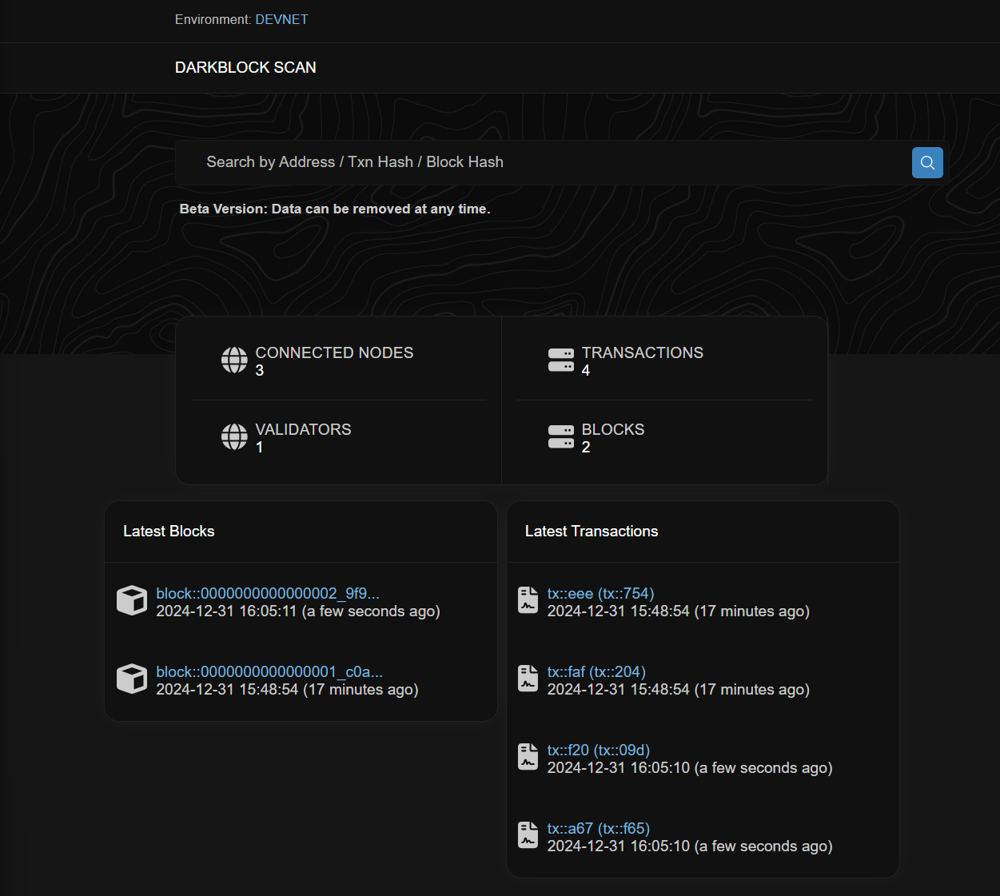

# DarkBlock - Metadata Blockchain

[](https://github.com/janrockdev/darkblock/actions/workflows/go.yml)

(in progress)

language	files	total
Go	        24  	4,143


## Description
This project aims to create a custom blockchain tailored for metadata use cases. The focus is on building a flexible and modular architecture that allows for easy customization and integration with various network protocols. The blockchain will support efficient metadata storage, retrieval, and management, making it ideal for applications that require robust and fast metadata tracing proof.

## Modules
- crypto/keys/sha3(post-quantum ready)

## Flows

## Install

### Protobuf compiler
```shell
go install google.golang.org/protobuf/cmd/protoc-gen-go@latest
go install google.golang.org/grpc/cmd/protoc-gen-go-grpc@latest
export PATH="$PATH:$(go env GOPATH)/bin"
```
## Run
```shell
go run client/client.go -port=:4000
```

### UML generator
```shell
go install github.com/jfeliu007/goplantuml/cmd/goplantuml
~/go/bin/goplantuml -recursive . > diagram.puml
# https://www.plantuml.com/
```

### Badger
```shell
go get github.com/dgraph-io/badger/v4
```

### Couchbase
```shell
docker run -d --name db -p 8091-8096:8091-8096 -p 11210-11211:11210-11211 couchbase
# create bucket blocks and transactions with 2GB+ memory / credentials: Administrator/password etc.
# UI access: http://localhost:8091/ui
```

### UI (Dashboard/Scan)
